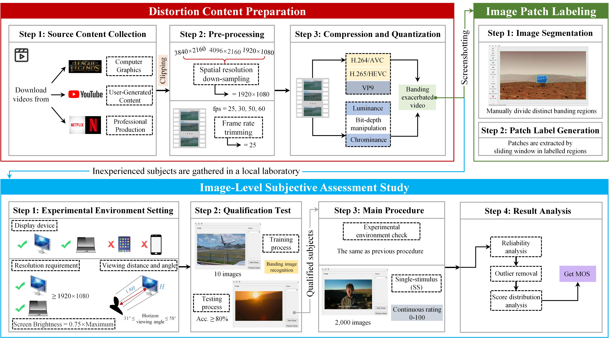
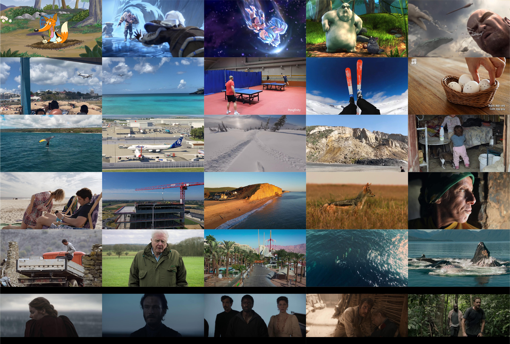
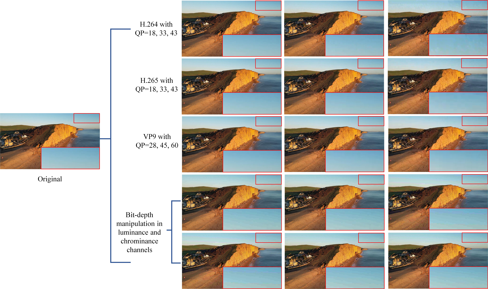

<div align="center">

<div>
<a href="https://github.com/zijianchen98/BAND-2k"></a>
    <a href="https://github.com/zijianchen98/BAND-2k"></a>
    <a href="https://ieeexplore.ieee.org/document/10438477"></a>
    <a href="https://github.com/zijianchen98/BAND-2k"></a>
    <a href="https://github.com/zijianchen98/BAND-2k"></a>
</div>

<h1>BAND-2k: Banding Artifact Noticeable Database for Banding Detection and Quality Assessment</h1>

_How banding artifacts affect the viewing quality?_

<div style="width: 80%; text-align:center; margin:auto;">
</div>

</div>


## Introduction
This is a repository of the paper [**"BAND-2k: Banding Artifact Noticeable Database for Banding Detection and Quality Assessment"**](https://ieeexplore.ieee.org/document/10438477) (authored by **Zijian Chen, Wei Sun, Jun Jia, Fangfang Lu, Zicheng Zhang, Jing Liu, Ru Huang, Xiongkuo Min\*, and Guangtao Zhai\*.** ) and its early work [**"FS-BAND: A Frequency-Sensitive Banding Detector"**](https://arxiv.org/abs/2311.18216) (accepted by ISCAS2024)  

We constructed so far the largest banding-affected database,  named Banding Artifact Noticeable 2k Database (BAND-2k). It contains 2,000 distorted images clipped from over 870 source videos with four encoding schemes: H.264, H.265, VP9, and bit-depth manipulation. A total of 44,371 scores were collected by 23 non-experienced subjects in an offline laboratory environment.

---

### :triangular_flag_on_post: Updates/Changelog
- We are currently organizing the code for BAND-2k may bring as soon as possible.
- **Jan 08, 2024**. Reupdate the BAND-2k database to Onedrive and Baidu Netdisk (fixed the filename errors).
---


## Visualization
#### Sample images in BAND-2k Database
<div style="width: 80%; text-align:center; margin:auto;">

</div>

#### The diversity of quantization means
<div style="width: 80%; text-align:center; margin:auto;">

</div>


## Database Link
We have uploaded the BAND-2k database to both OneDrive and Baidu Netdisk, and the download links are as follows:
[OneDrive](https://1drv.ms/u/s!AgLwywHLkSEMk1PoFcR3n7NrrYsS?e=qDEfSB);
[Baidu Netdisk](https://pan.baidu.com/s/1FAqIEePh795eZQYeFASQdg)  Code: knnn


## Citation
Please feel free to cite our paper if you use the BAND-2k database in your research:
```
@article{chen2024band,
  author={Chen, Zijian and Sun, Wei and Jia, Jun and Lu, Fangfang and Zhang, Zicheng and Liu, Jing and Huang, Ru and Min, Xiongkuo and Zhai, Guangtao},
  journal={IEEE Transactions on Circuits and Systems for Video Technology}, 
  title={BAND-2k: Banding Artifact Noticeable Database for Banding Detection and Quality Assessment}, 
  year={2024},
  pages={1-16},
  doi={10.1109/TCSVT.2024.3366522}}
}
@article{chen2023fs,
  title={FS-BAND: A Frequency-Sensitive Banding Detector},
  author={Chen, Zijian and Sun, Wei and Zhang, Zicheng and Huang, Ru and Lu, Fangfang and Min, Xiongkuo and Zhai, Guangtao and Zhang, Wenjun},
  journal={arXiv preprint arXiv:2311.18216},
  year={2023}
}
```
